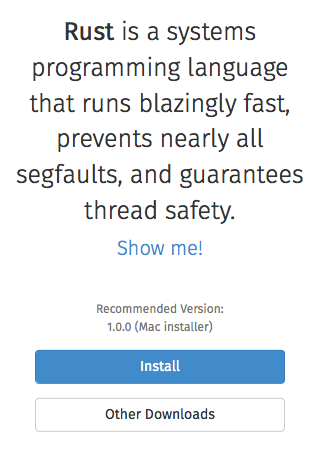

# Rust in Gecko

In the media playback team we've been working on writing parser code in the new
rust programming language for safety. I'll talk about what this looks like, why
it's important, and how other contributors can try it too.

Ralph Giles
2015 June 24
Whistler, Canada

---

# Why

We don't know how to write safe, concurrent C++ code.

Media playback is cpu-intensive, must juggle many resources.

Seems ideal for thread parallelism, but we've had lots of
trouble with races, deadlocks, inefficiency.

---

# Why not?

We've been using the stagefright mp4 demuxer (from Android).
Found ~6 security vulnerabilities this year alone.

This is the problem rust was designed to solve.

---

# Rust in Gecko

.center[]
.center[]

---

# Install rust

.center[]

- Install button on http://www.rust-lang.org/

---

# Install rust (Command line)

- Update tool https://github.com/rust-lang/rustup

```sh
$ rustup

Welcome to Rust.
[...]
rustup: gpg available. signatures will be verified
rustup: downloading manifest for 'stable'
rustup: downloading toolchain for 'stable'
######################################################################## 100.0%
[...]
install: installing component 'rustc'
install: installing component 'cargo'
install: installing component 'rust-docs'

Rust is ready to roll.
```

---

# Enable rust

In mozconfig:

```sh
ac_add_options --enable-rust
```

On Mac:

```sh
ac_add_options --enable-macos-target=10.7
```

---

# Verify

```gtest
$ ./mach gtest rust.*
 0:00.26 /usr/bin/make -C testing/gtest -j8 -s -w gtest
 [...]
Running GTest tests...
Note: Google Test filter = rust.*
[==========] Running 3 tests from 1 test case.
[----------] Global test environment set-up.
[----------] 3 tests from rust
[ RUN      ] rust.MP4MetadataEmpty
[       OK ] rust.MP4MetadataEmpty (0 ms)
[ RUN      ] rust.MP4Metadata
[       OK ] rust.MP4Metadata (0 ms)
[ RUN      ] rust.CallFromCpp
[       OK ] rust.CallFromCpp (0 ms)
[----------] 3 tests from rust (0 ms total)

[----------] Global test environment tear-down
[==========] 3 tests from 1 test case ran. (0 ms total)
[  PASSED  ] 3 tests.
Finished running GTest tests.
```

---

# Add code

In moz.build:

```python
if CONFIG['MOZ_RUST']:
    SOURCES += ['hello.rs',]
    UNIFIED_SOURCES += ['TestRust.cpp',]
```

---

# Foreign Function Interface

Rust can target the C ABI. In C++ code declare:

```C
#ifdef MOZ_RUST
extern "C" uint8_t* test_rust();
#endif
```

In rust code implement:

```rust
#[no_mangle]
pub extern fn test_rust() -> *const u8 { ... }
```

Toy linkage example at
https://github.com/rillian/rust-ffi/

---

# More

Tracking bug https://bugzil.la/oxidation

MDN https://developer.mozilla.org/en-US/Firefox/Building_Firefox_with_Rust_code

IRC #rust is full of helpful people
